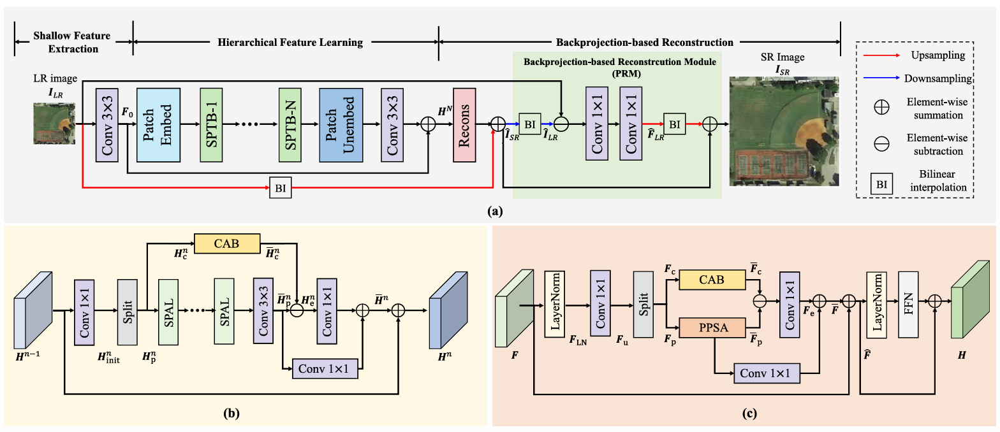

# [IEEE-TGRS-2024]Scale-aware Backprojection Transformer for Single Remote Sensing Image Super-Resolution

This is the official repository for Scale-aware Backprojection Transformer (SPT). This repository contains:

* [x] Full code for test.
* [x] Pretrained models for x4 single remote sensing image super-resolution on the UCMerced dataset.

Related links:
[[Official PDF Download]](https://ieeexplore.ieee.org/abstract/document/10753509)

## Requirements:

* torch>=1.12.1
* torchvision>=0.13.1
* timm>=0.9.2

## Introduction
Backprojectionnetworkshaveachievedpromising super-resolutionperformancefornature imagesbutnotwellbe explored intheremote sensing image super-resolution(RSISR) field due to the high computation costs. In this article, we propose a scale-aware backprojectionTransformer termed SPT for RSISR. SPT incorporates the backprojection learn ing strategy into a Transformer framework. It consists of scale-aware backprojection-based self-attention layers (SPALs) for scale-aware low-resolutionfeature learningandscale-aware backprojection-basedTransformer blocks (SPTBs) for hierar chical feature learning. Abackprojection-based reconstruction module (PRM) is also introduced to enhance the hierarchical features for imagereconstruction.SPTstandsoutbyefficiently learning low-resolution featureswithout excessivemodules for high-resolution processing, resulting in lower computational resources.ExperimentalresultsonUCMercedandAIDdatasets demonstrate thatSPTobtains state-of-the-art resultscompared toother leadingRSISRmethods.


## Dataset
Datasets：[Baidu Netdisk(nd9k)](https://pan.baidu.com/s/1aGUMmwaASonSy9YPSsDZbg)

The format we use for the dataset is as follows:
```
├── datasets
    ├── AID-dataset
    │   ├── trainsets
    │       ├──HR
    │       ├──LR_x2
    │       ├──LR_x3
    │       └──LR_x4
    │   ├── valsets
    │       ├──HR
    │       ├──LR_x2
    │       ├──LR_x3
    │       └──LR_x4
    │   └── testsets
    │       ├──HR
    │       ├──LR_x2
    │       ├──LR_x3
    │       └──LR_x4
    └── UCMerced
        ├── train
        │   ├──trainH
        │   ├──trainLx2
        │   ├──trainLx3
        │   └──trainLx4
        ├── test
        │   ├──trainH
        │   ├──trainLx2
        │   ├──trainLx3
        │   └──trainLx4
        └── val
            ├──valH
            ├──valLx2
            ├──valLx3
            └──valLx4
```

## Validate the performance


Download the pretrained weights to `pth` directory first. Then use the following commands to validate the performance:

Pretrained weights：[Baidu Netdisk(5fvu)](https://pan.baidu.com/s/10YNf-sBm5fLol0dAOO3c4A)

````bash
python test_SPT_UCM_x4_tta.py --scale 4 --model_path pth/UCMerced_x4_SPT.pth --folder_lq ${YOUR_LR_PATH} --folder_gt ${YOUR_HR_PATH}
# --folder_lq ${YOUR_LR_PATH}: Replace ${YOUR_LR_PATH} with the path to your low-quality (LR) data directory.
# --folder_gt ${YOUR_HR_PATH}: Replace ${YOUR_HR_PATH} with the path to your high-resolution (HR) ground truth data directory.
````

## Citation

If you are using the code/model/data provided here in a publication, please consider citing our works:

````
@ARTICLE{hao2024scale,
  title={Scale-aware Backprojection Transformer for Single Remote Sensing Image Super-Resolution},
  author={Hao, Jinglei and Li, Wukai and Lu, Yuting and Jin, Yang and Zhao, Yongqiang and Wang, Shunzhou and Wang, Binglu},
  journal={IEEE Transactions on Geoscience and Remote Sensing},
  year={2024},
  publisher={IEEE}
}
````

## Other Notes

If you meet any problems, please do not hesitate to contact us.
Issues and discussions are welcome in the repository!
You can also contact us via sending messages to this email: liwukai51@gmail.com

## License
This code is released under the Creative Commons Attribution-NonCommercial-ShareAlike 4.0 International Public License for Non-Commercial use only. Any commercial use should get formal permission first.
